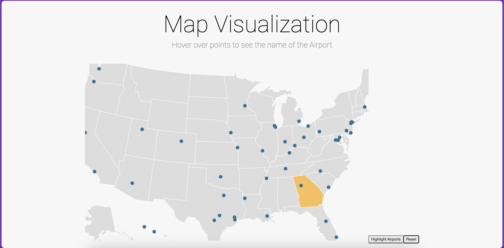
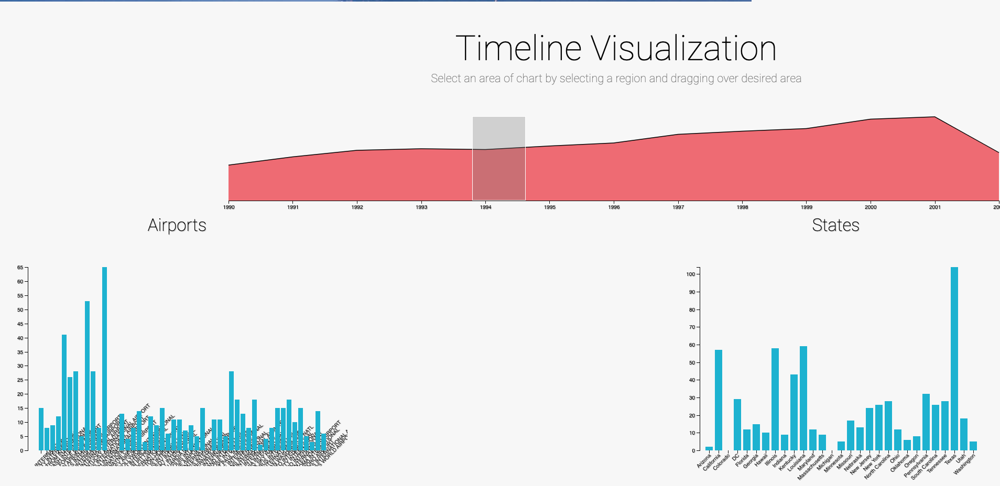
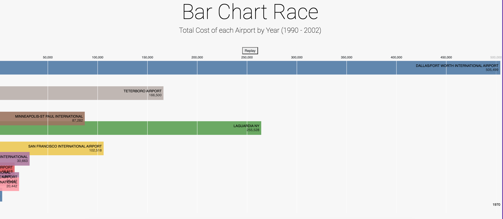
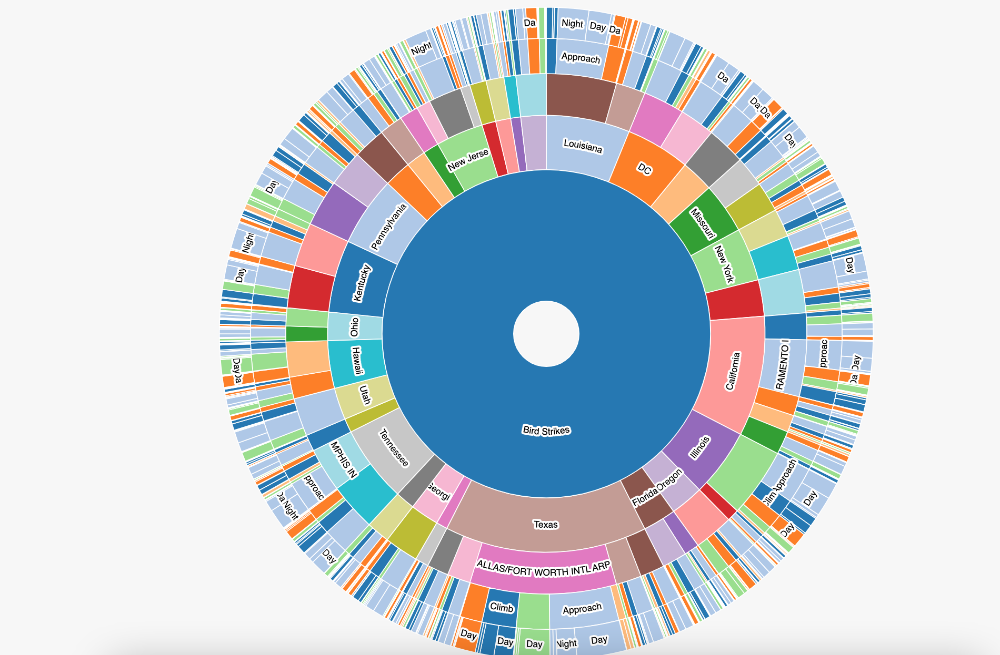

## Bird Strike Visualization Project
   
### Introduction

This project aims to develop an interactive dashboard for visualizing bird strike data. As an aviation enthusiast and data aficionado, I've embarked on this journey to gain insights into bird strike incidents, their timeline, contributing factors, and the distribution of incidents across airports and states.

### Data Preprocessing

1. **Airports Data**

   - Leveraging comprehensive airports data to uncover the vast network of airports across the United States.
   - This data serves as the foundation for visualizing airports on the map.
2. **US Airports Data**

   - Filtering the airports dataset to focus exclusively on airports within the United States.
   - This refined dataset ensures a precise representation of US airports on the map visualization.
3. **Bird Strikes Data**

   - Exploring bird strikes data to understand the nature and frequency of incidents.
   - This dataset forms the core of our visualization, providing valuable insights into bird strike incidents.

### Project Components

1. **Map Visualization (Discovering Airports)**

   - Utilizing data scraping techniques to unveil airports from different origin states on the map.
   - Each airport is distinctly marked, providing a visual narrative of their geographical distribution.
   - A special emphasis is placed on highlighting affected airports during specific timelines, offering deeper contextualization.

   
2. **Timeline Visualization (Unraveling the Past)**

   - Unraveling the timeline of bird strike incidents, offering a glimpse into historical occurrences.
   - Acting as a dynamic filter, empowering users to dive into specific timelines and unravel hidden patterns.

   
3. **Graph Visualization (Deciphering Factors)**

   - Deciphering the complex web of factors contributing to bird strike incidents.
   - Visualizing the impact of each factor during selected timelines, shedding light on their relative significance.

   
4. **Hierarchy Visualization (State and Airport Relations)**

   - Visualizing the intricate relations between states and airports in terms of bird strike incidents.
   - Providing a holistic view with parent nodes representing states and child nodes representing airports, showcasing incident counts.

### Dashboard Experience

1. **Immersive Interactivity**

   - Embracing a user-centric approach, the dashboard offers seamless interactivity with features like panning, zooming, and selection.
2. **Coordinated Views**

   - Ensuring a cohesive narrative, visualizations are linked via brushing and linking, fostering a deeper understanding of the data landscape.
3. **Innovative Exploration**

   - Embracing innovation, at least one visualization incorporates advanced techniques like Focus + Context, enhancing the exploration experience.

### Dataset Exploration

- **Bird Strikes CSV File:** [Download Here](https://drive.google.com/file/d/1LnykpS5AcLFsZcODVcJ9cTQOxsdIXL7L/view?usp=share_link)
- Delve into the dataset to uncover insights into bird strike incidents, their nature, and impac.

### Code Submission

- Submit your masterpiece in a zip file, encapsulating your journey through code.
- Whether it's a single HTML file or multiple files (HTML, CSS, JavaScript), let your creativity shine.

### Recommendations

- Dive into the vast ocean of D3.js for visualization prowess.
- Keep your journey smooth by ensuring consistency in D3.js versions, avoiding integration hiccups.
- Draw inspiration from the vast repository of examples and documentation available online to fuel your creativity.

Welcome aboard this exhilarating journey of data exploration and visualization. Let's embark on this voyage together, unraveling the mysteries hidden within the vast expanse of bird strike data. 🚀✨
